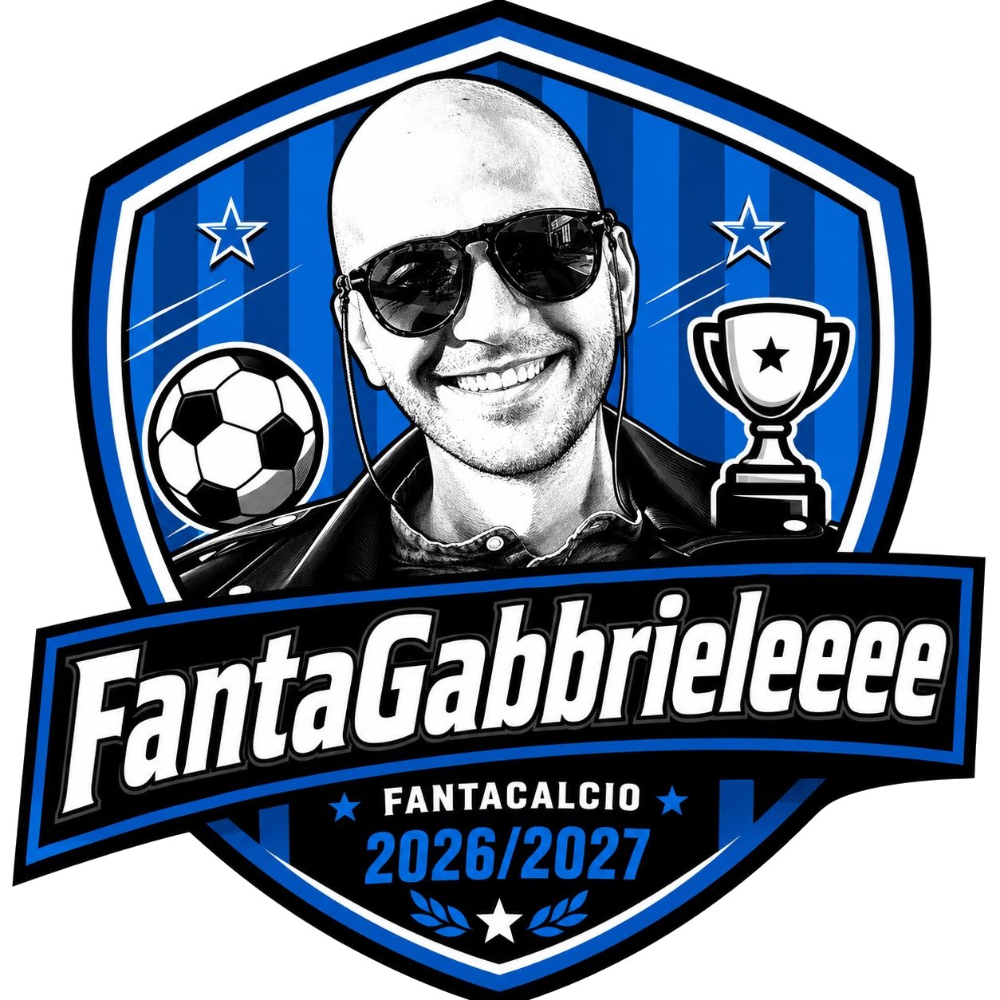

<p align="center">
  
</p>

<h1 align="center">FantaGabrieleeee</h1>

<p align="center">
  A toy web app for running a live <em>Fantacalcio</em> (Italian fantasy football) auction with friends — with an AI advisor doing the football knowledge I don't have.
</p>

## About

I know basically nothing about football players. FantaGabrieleeee exists so I can still run our league's live auction and build a competitive squad, by leaning on an AI advisor for calls, bids, and team strategy while the humans argue over the microphone.

It was **vibe-coded end to end in about two days** as a fun side project for one specific use case: my own group's draft night. It is not a polished product — expect rough edges, missing features, and code that optimizes for "works for us" over "works for everyone."

## What it does

- **Player database** — import the official quotazioni spreadsheet (`.xlsx`) to populate teams and players, including both Classic and Mantra roles/quotations.
- **Live auctions** — create an auction, invite participants, and run the draft turn by turn in real time (via WebSockets/Laravel Reverb): call a player, place bids, assign the winner, track remaining budget and roster slots per participant.
- **Strategies** — sketch a squad-building strategy (diversified, balanced, or superstars-focused) ahead of the auction.
- **AI Advisor** — during the auction, ask the AI (streaming, reasoning shown live) who to call next, how much to bid on the player currently up for auction, or for a full budget/priority-targets strategy for your team.

## Tech stack

- [Laravel 13](https://laravel.com/) on PHP 8.3+
- [Inertia.js v3](https://inertiajs.com/) + [React 19](https://react.dev/) + TypeScript
- [Tailwind CSS v4](https://tailwindcss.com/) + shadcn/radix UI components
- [Laravel Reverb](https://reverb.laravel.com/) for real-time auction updates
- [Laravel AI](https://github.com/laravel/ai) for the streaming AI advisor
- [PhpSpreadsheet](https://phpspreadsheet.readthedocs.io/) for player quotation imports
- [Pest](https://pestphp.com/) for testing

## Getting started

Requirements: PHP 8.3+, Composer, Node.js, npm.

```bash
composer install
npm install
composer run setup   # copies .env, generates the app key, runs migrations, builds assets
```

Configure an AI provider key (e.g. `OPENAI_API_KEY` or `ANTHROPIC_API_KEY`) in `.env` for the advisor to work.

Start the app (Laravel server, queue worker, Reverb, and Vite together):

```bash
composer run dev
```

Then visit the app URL and register an account to create your first auction.

## Disclaimer

This is a hobby/toy project built quickly for personal use. There's no warranty, no support, and no promise it fits your league's rules — feel free to fork it and adapt it to yours.
